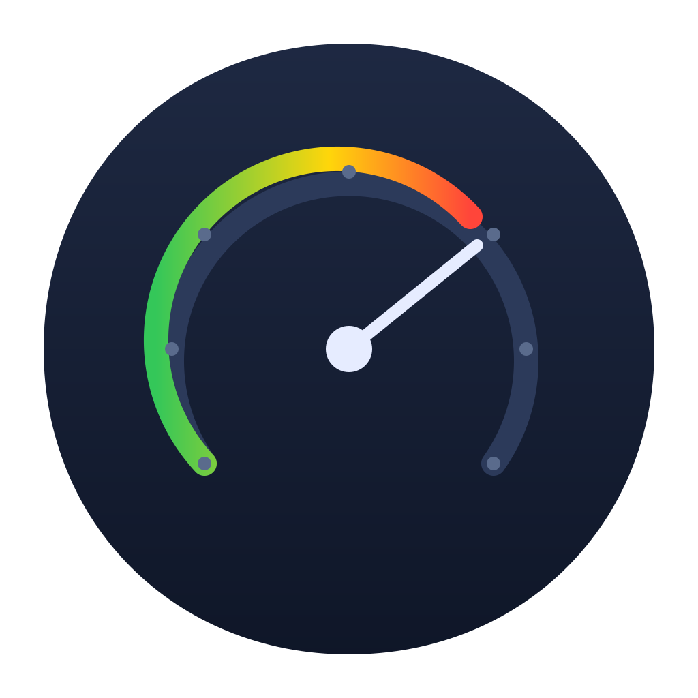

<div align="center">



# AIMonitor

A tiny native macOS menu bar app that shows the remaining usage, limits, and health of every AI service you use.

[](https://github.com/mgks/AIMonitor)
[](https://github.com/mgks/AIMonitor/releases)
[](LICENSE)

</div>

## Features

- **Menu bar glance**: icon + optional usage percentage for one selected provider
- **Dual-window cards**: each provider shows both 5-hour and weekly quota with progress bars
- **Auto-refresh**: every 60 seconds (configurable), fetches on launch
- **Notifications**: alerts when quota drops below 20%, 10%, exhausted, or resets
- **7 providers**: Claude Code, Codex, Kimi, MiniMax, Z.ai (GLM), DeepSeek, OpenRouter
- **Region switching**: MiniMax and Z.ai support international and China endpoints
- **Zero keychain prompts**: credentials stored in a local file, not the macOS Keychain
- **Open source**: MIT, no analytics, no backend

## Installation

Download the latest `.dmg` from [Releases](https://github.com/mgks/AIMonitor/releases)

### Build from source

Requires macOS 13+ and the Command Line Tools (no Xcode needed):

```bash
git clone https://github.com/mgks/AIMonitor.git
cd AIMonitor
make deploy
```

`make deploy` builds the app, renders the icon, assembles the `.app` bundle, copies it to `/Applications`, and launches it.

## Getting started

1. Launch AIMonitor. A gauge icon appears in your menu bar.
2. Click the icon, then **Preferences**.
3. Go to the **Providers** tab. Toggle on the providers you use. Each provider expands to show its API key field or OAuth setup instructions.
4. Paste your API keys directly in the expanded fields.
5. In **General**, configure refresh interval, appearance, menu bar summary, and notifications.

Only enabled providers with keys appear in the popover. Keys are stored locally and never leave your machine.

## Supported providers

### OAuth providers (no manual key needed)

Log in with the official CLI tool once, then toggle the provider on. AIMonitor reads the credentials automatically and refreshes expired tokens.

| Provider | Setup | What you see |
|---|---|---|
| **Claude Code** | `npm i -g @anthropic-ai/claude-code && claude` | 5h + 7-day windows, plan tier |
| **Codex (OpenAI)** | `npm i -g @openai/codex && codex login` | 5h + 7-day windows |

### API-key providers

Paste your key in the Providers tab. Supports international and China endpoints where applicable.

| Provider | Region options | What you see |
|---|---|---|
| **Kimi** | International | 5h + Weekly coding plan quota |
| **MiniMax** | International / China | 5h + Weekly Coding Plan quota |
| **Z.ai (GLM)** | International / China | 5h + Weekly Coding Plan quota |
| **DeepSeek** | International | Account balance (USD/CNY) |
| **OpenRouter** | International | Credit balance + usage |

## For developers

<details>
<summary>Build & architecture</summary>

### Build commands

```bash
make build     # swift build (release)
make run       # swift run (shows dock icon)
make icon      # render AppIcon.icns
make bundle    # assemble .app without deploying
make deploy    # build + deploy to /Applications + launch
make clean     # remove build artifacts
```

### Architecture

```
Sources/AIMonitor/
├── App/            SwiftUI shell: MenuBarExtra, cards, settings
├── Core/           Provider protocol, models, HTTP client, credential store,
│                   OAuth reader, scheduler, notifications
├── Providers/      One folder per provider, no cross-dependencies:
│   ├── Claude/     OAuth, auto-refresh, usage endpoint
│   ├── Codex/      OAuth, auto-refresh, usage endpoint
│   ├── Kimi/       API key, coding plan
│   ├── MiniMax/    API key, coding plan remains
│   ├── Zai/        API key, quota limit (no Bearer prefix)
│   ├── DeepSeek/   API key, account balance
│   └── OpenRouter/ API key, credit balance
└── Settings/       Preferences window (General, Providers, About)
```

Each provider implements `AIProvider.fetchStatus(apiKey:)`. The view model passes keys in-memory from a local file store. No keychain access during refresh.

### Adding a new provider

1. Create `Sources/AIMonitor/Providers/YourProvider/YourProvider.swift`.
2. Implement `AIProvider` (fetch + parse + return `ProviderStatus`).
3. Add it to `ProviderRegistry.makeDefault()`.
4. Add config fields in `SettingsView.swift` Providers tab.

</details>

## License

MIT
